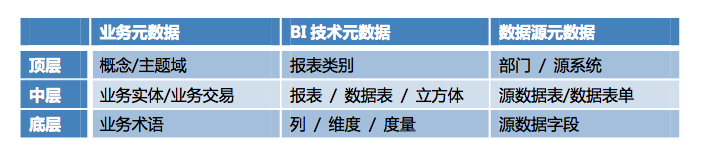
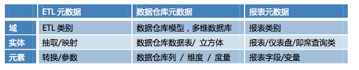
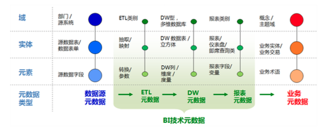

# 元数据管理

## 为什么需要元数据管理（Why）

面临的问题：  
1. 数据指标定义不一致，存在错误，理解不一致和重复等情况  
2. 不清楚当前目前已开发的指标  
3. 数据准确性很难监控，出了问题更难追踪到具体的问题  
3. 指标的 ETL 过程重复，混乱

元数据管理要达到的目标应该是：

1. 数据部门做技术开发时，能够快速检索，应用和改进
2. 业务 RD 在自己内部查询数据时，能够快速定位和查询
3. 业务 PM 分析师可以快速了解指标名称

## 什么是元数据（What）

按照传统的定义，元数据（Metadata）是关于数据的数据，它是描述数据仓库内数据的结构和建立方法的数据，即数据的背景。它是“所有系统、文档和流程中包含的所有数据的语境。是生数据的知识”。

再往下细究，还会存在元-元数据，即元数据的背景信息，称之为元数据模型。元数据模型是为了更方便地理解元数据。针对这些元数据模型的管理便是元数据管理。

## 什么是元数据模型

元数据模型一般会分为业务元数据和技术元数据，技术元数据可以再往下拆分为 BI 元数据和数据源元数据，具体区别如下：  

这三个可以理解为数据链条的三个环节，分别从数据源，到数据展示，最后反映到相应的业务情况上。举例说明，设计一个关于交易主题（业务）的数据产品，那么则需要交易类或订单类的报表集合（技术），然后从交易部门的业务库中获取数据（数据源）。

其中，顶层可理解为概念层或主题层，中层为实体层，底层为元素层，即细化到某个具体的指标定义，报表的某个度量以及源数据的某个字段。

这三者在具体的实施情况下，可再细分为：  
1. 技术元数据：业内人士的关心重点应该在这。  
   
    1. 数据仓库  
       2. ETL  
       3. 报表  
2. 业务元数据  
    1. 企业概念模型，包含了多维数据模型（但具体的表现形式是怎么样的？）~~确认下傅一平的数据字典建设历程~~  
       2. 数据字典？  
3. 数据源元数据

这三类元数据的关系如下：  

## 怎么管理元数据（How）

~~以下几个方案只是提到了几个小点，具体还得看情况进行补充。关键是，如何在互联网的改进之前 IOE 时代的元数据管理方法，使之更符合现有的管理模式？~~

### 

### 1. 元数据管理标准

1. MDC 组织的开放信息模型：OIM（Open Information Mode）

OIM的目的是通过公共的元数据信息来支持不同工具和系统之间数据的共享和重用。它涉及了信息系统（从设计到发布）的各个阶段，通过对元数据类型的标准描述来达到工具和知识库之间的数据共享。OIM所声明的元数据类型都采用统一建模语言UML（Universal Modeling Language）进行描述，并被组织成易于使用、易于扩展的多个主题范围（Subject Areas）。

具体该如何实施，与现实中的企业实践如何发生联系？

1. OMG 组织的的公共仓库模型：CWM（Common Warehouse Model）

OMG是一个拥有500多会员的国际标准化组织，著名的CORBA标准即出自该组织。公共仓库元模型（Common Warehouse Metamodel）的主要目的是在异构环境下，帮助不同的数据仓库工具、平台和元数据知识库进行元数据交换。

### 1. ETL 元数据管理

1. 控制元数据：为了控制 ETL 处理过程而部署的元数据称为控制元数据。了解 DW 中的加载记录数和拒绝记录数，或者创建过程依赖性指标，如有 xx 个ETL 过程是否运行成功，从而把握整个处理流程的准确性。
2. 过程元数据：用于过程处理目的的元数据称为过程元数据。数据源到 BI 环境的回溯性和血统将作为过程元数据被收集，它使开发者/设计者在发生变更时便于做影响分析。这里面涉及到对数据的解析，转换，清洗和校验几个过程的定义和监控。

这些内容落到具体位置，就是 ETL 元数据管理功能，从中需要明确每个ETL 任务的计算过程，以及每个 ETL 过程的监控系统，落地的产品功能如数据地图，血缘分析。

### 2. 报表元数据管理

1. 报表/看板 元数据：用户可以直接使用定义好的报表或看板进行分析。对于这些报表/看板 亦需要管理起来，控制好权限，及时更新，并定期清除过期的报表/看板。
2. 指标元数据：即数据字典， 用户既可以在界面上查询到相应指标的定义，也可以在拖拽式报表工具中自定义报表。~~数据字典该如何建立，也是一个大话题~~

### 3. 管理工具

以上是两个比较抽象的管理理念，具体到产品功能上，会有以下的内容：

#### 1. 数据地图：

它以拓扑图的形式对数据系统的各类数据实体、数据处理过程元数据进行分层次的图形化展现，并通过不同层次的图形展现粒度控制，满足开发、运维或者业务上不同应用场景的图形查询和辅助分析需要。

~~数据地图的具体形态是什么样的？与血缘分析有什么异同？~~

#### 2. 元数据分析

1. 血缘分析：也称血统分析）是指从某一实体出发，往回追溯其处理过程，直到数据系统的数据源接口。对于不同类型的实体，其涉及的转换过程可能有不同类型。在这个基础上可以再做实体间的关联分析和差异分析，以及指标一致性分析，更深入了解数据间的关系。
2. 影响分析：影响分析是指从某一实体出发，寻找依赖该实体的处理过程实体或其他实体。如果需要可以采用递归方式寻找所有的依赖过程实体或其他实体。该功能支持当某些实体发生变化或者需要修改时，评估实体影响范围。

做好元数据管理后，可以辅助应用优化和安全管理，能够

> 参考文献：
>
> 信息整合-元数据管理全景，Kamlesh Mhashilkar， Jaideep Sarkar
>
> [元数据管理解析以及数据仓库和主数据介绍](http://www.10tiao.com/html/615/201605/2656595506/1.html)

