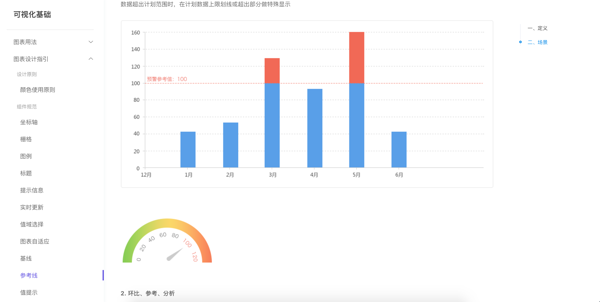
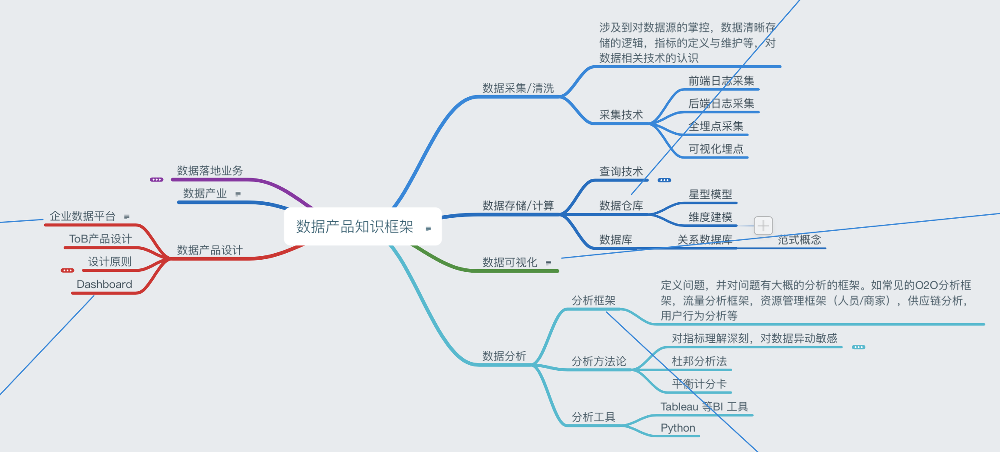
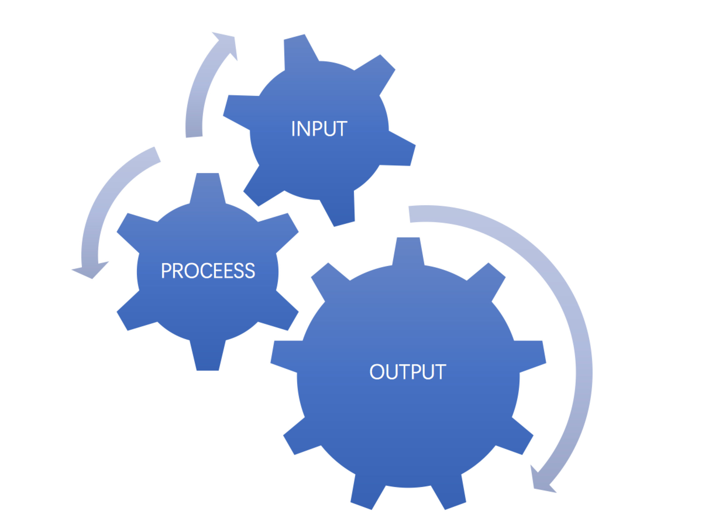

# 数据产品经理进阶之路

近日有些同学在小密圈里问我数据 PM 如何成长的问题，有些刚入行不久的 PM，有些是刚被公司安排到了数据线。个人当年阴错阳差，入了数据这个行业，当时还没有数据产品经理这种叫法。趁这个机会，总结了些浅薄经验与大家分享，希望能给入行不久的同学们一些启发。

## 0. IPO 方法论
《未来简史》提出来一个很有趣的思考角度 ：生物本身就是算法，生命就是数据处理的过程。但凡算法，就会涉及三个过程：Input（输入），Process（处理），OutPut（输出）。每个学习过程，每种知识理论的学习，吸收和实践都可以从这个角度去切割。

## 1. Input：保证质和量上的输入
输入有很多方式，为了简单可复制，这里只介绍阅读（看）和交流（聊）两种。唯一的原则就是**持续的高质量输入**，日累月积，这个原则带来的复利效应会非常惊人。

### 1.1 看：最系统的输入方式
查理·芒格在《穷查理宝典》中颇以“行走的书架”外号自诩，可见其对读书的推崇。在产品上，非常经典的书籍很少，数据产品则更少了。所以除了正常书籍之外，我们也需要多从其他渠道获取输入。

1. 看书：数据分析，产品设计，数据技术（仓库，元数据，可视化等）等等都是我们学习的方向。我以前介绍过一个类似的书单，供大家参考：**插入链接**
  
2. 看产品：业内相关产品学习，分析思路，指标和维度选择等。他们的帮助文档也是个非常珍贵的学习资源。如阿里云数加的说明资料，蚂蚁金服 AntV Design 数据可视化规范，GrowingIO 和神策数据的帮助文档，这些都是非常宝贵的学习资料。
  
3. 看公司文档：美团的 Wiki 机制非常棒，可以从中学到不少同事对于数据，对于产品的思考。这就是一个好公司什么非常重要的原因，其中的经验积累会让你少走很多弯路。要养成一个习惯：到一个新公司后，先通过该公司的文档机制，去了解产品的发展，思考的角度以及讨论的风格，这个可以帮你快速地了解到该公司的风貌。
  
4. 看新闻博客：诸位大牛的博客文章，多了解学习前线的执行知识。从公众号上看，曹政的「caoz的梦呓」，经常会结合自己的从业背景和数据知识，会不时讲一些利用数据了解商业世界规律的内容。车品觉老师的「品觉」会不时摘抄些国外的前沿数据知识，都值得一读。另外，Airbnb 和 Ebay 等的技术博客也会时不时介绍些数据相关的知识。
  
5. 看行业数据：了解目前行业内的数据情况，有利于培养自己的数据敏感度及对行业的判断。国外如Garter 每年发布的 BI 报告，Google Trends 等。国内的 Questmobile 是比较靠谱的第三方数据源，经常会出一些行业排行。腾讯 2016 年财年的年报也多处引用了他们家的数据作为支撑。 ```(我可没收他们家广告费)``` 同时，看各大公司的财报也是个非常不错的途径。


 ### 1.2 聊：最便捷的输入方式
三人行必有我师这种话都比较老套了。但和人沟通，的确可以很好地比避开一些思维盲区。其他人的经验，和渠道都会给人带来很多灵感。


1. 向前辈学习：对于新人来讲，职场因素的排序应该是这样的：好领导 ＞ 好公司 ＞ 好职位 ＞ 好薪酬。鉴于他们之前有个成型的框架，可以帮你少走很多弯路。少走弯路 = 节省时间 = 提升速度加倍提升，这个非常关键。如果有个“好为人师”的领导，可千万不要放过。

2. 向同事学习：三人行，必有我师。不同职位的人有不同技能和知识领域的差别，向他们可以学习到不少知识，这些知识可以反过来沉淀为数据产品的思路。像我个人，会喜欢找渠道，运营的人聊天，了解他们怎么运营数据。有小朋友问我，如何和商业分析的同事争夺数据分析的话语权。我当时答复：**不要将他们当对手，要把他们当资源，当助力，如何结合他们的知识，经验和触达前线的能力，来完成更好的产品设计。**

3. 空杯心态：心态一定要放平和，有些人有点成绩后，觉得世界之大皆可取之。其实天空海阔，人绝大时候面前只能看到一方水井，如同人类可见光部分只能占据整个光谱很小的部分，但绝大数人终其一生却只认为这就是世界。

最后总结：输入方千千种，并不能说哪种更高效，只能说哪种方法在哪种环境下对哪种人更有效，切忌抓住事物中段。德鲁克在《管理自己》中提到：

> 我属于读者型，还是听者型？首先，你要搞清楚的是，你是读者型（习惯阅读信息）还是听者型（习惯听取信息）的人。绝大多数人甚至都不知道还有读者型和听者型之说，而且很少有人既是读者型又是听者型。知道自己属于哪种类型的人更少。但是，有一些例子说明了这样的无知可能造成多大的危害。 

      
## 2. Process：构建思考框架
取得大量输入后，如同买回来了大量新鲜美味的食材，那么如何将它煮成美味的菜肴？这时候就需要有烹饪的技巧及工具了。


   ### 2.1  构建框架的原则
  1. 准确 && 自洽：框架的每部分内容需要通过高质量 Input 的验证，确保内容准确，且各部分间要能够逻辑自洽，没有严重冲突的地方。
  2. 关联场景：每部分 Input 都要与之前的知识，之前和未来的可能应用场景关联起来，才能起到举一反三，挥之即来的地步。且需要根据 Input && Output 不断更新，补充。
  3. 可被实践：形成框架的内容不能束之高阁，而要多寻找实践行为。一定要坚持共产党人的”实践是检验真理的唯一标准“，坚持从理论中来，到理论中去的根本原则。
 
### 2.2 数据产品知识框架
在 Why 层次，建立框架来明确每个模块知识在系统中的位置，以及明确自己的学习方向。这样才能做到有针对性地学习和进化。

在 How 层次，需要强调的一点是**寻找 Best Practice**。了解 Best Practice 能够迅速帮你建立该领域最高的审美，来迅速判断当前做的事情是否符合标准。比如说，在后台组件设计和可视化规则上，Ant Design 算是可国内先河，以此标准衡量经手的后台产品，你就会明白很多设计在最开始的时候就该找什么样。当然，审美上升到最高层次，就是科学和人性，层次越高，爆发的能量越大，如 Steven Jobs 等。

在 What 层次，需要站在业务角度，站在负责人角度去思考数据产品的工作。我个人划分的数据知识框架如下，供大家参考


## 3. Output：以输出强迫自己沉淀

1. 定期总结并输出，落地为文档，PPT 等资料，可与别人分享。分享内容本身就是个梳理已有知识并巩固的过程。分享动作会让你更加严谨地考证你的输出，并获得外界的反馈。分享的对象可以是同事，上级，甚至是网络上的用户。因此维护一个博客，或者公众号等方式，都是一个不错的习惯。我个人是因为喜欢不时写点东西，也有总结的习惯，因此一直保持的实践：

2. 将所学理论应用到原先的情况中去，反哺 Input

3. 多进行数据产品设计的实践：新人容易沉浸在可视化的页面搭建中难以自拔，其实最核心的是解决了什么问题，提供了什么价值，其中的业务逻辑是什么样子的。只要明确了这些内容，哪怕页面是一堆线形图报表，都无关紧要。以下是《Information Dashboard Design》中的示例样子，图表平凡却能起到提纲挈领，引导分析的作用。


## 4. IPO 相辅相成

最后需要说明的是，这三个环节相辅相成，Input 为 Process 和 Output 提供素材，在 Process 中交叉产生的洞察和结果也能作用到 Input 和 Output 上。而 Output 获得的反馈和经验更能反过来成为 Input 和 Process 的上游内容，促使整个系统生生不息，不断自我进化。


近期文章的链接
招聘内容
小密圈的截图


